华擎ASROCK b360m itx/ac黑苹果EFI
====

作者: idx

[toc]

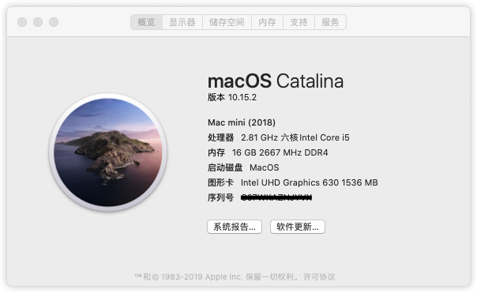

.png)

# 配置

| name      | product                   | commet                                                       |
| --------- | ------------------------- | ------------------------------------------------------------ |
| CPU       | Intel i5 8400             |                                                              |
| 主板      | asrock b360m itx/ac       | LAN: Intel® I219V<br>Audio: ALC887(layout 5)<br>Display: DP(4K@60Hz) + HDMI(4K@30Hz) + DVI<br>M.2: Type2280 + Type2230<br>USB: 前2个, 后4个<br>PCIe3.0x16: 1 |
| 内存      | ADATA 16G(8Gx2)           | 主板 2 x DDR4 DIMM Slots ，max 32GB                          |
| SSD       | Intel 760P 256G           | 备用: wd sn750, 三星 970 evo plus                            |
| HDD       | WD SATA 2.5英寸 黑盘 1T   |                                                              |
| Wi-Fi/BT  | DW1820a                   |                                                              |
| 机箱/电源 | 迎广肖邦, 自带150铜牌电源 |                                                              |
| 散热器    | 乔思伯HP400               |                                                              |

主板自带无线模块, 蓝牙可以用, 但是wifi不能使用, 直接取下来, 换上dw1820a(ngff接口)

如果偶尔dw1820a的蓝牙或者wifi无法使用, 重启也无法修复, 请关机, 拔下电源线, 再开机


# 黑苹果工具

## 必备工具

[Hackintool](http://headsoft.com.au/download/mac/Hackintool.zip): 黑苹果工具, 查看电脑信息, 下载 升级 kext

[ProperTree](https://github.com/corpnewt/ProperTree): 用于OpenCore

[OpenCore Configurator](https://mackie100projects.altervista.org/download-opencore-configurator/): 用于OpenCore

[OpenCore](https://github.com/acidanthera/OpenCorePkg) OpenCore github


# BIOS设置

> 支持 `Clover` 和 `OpenCore`

- Boot>Fast Boot(快速启动) → disable
- Boot>CSM(兼容性支持模块) → disable
- Advanced>CPU Configuration>CFG Lock → disable
- Advanced>Chipset Configuration>VT-d → disable
- Advanced>Intel Virtualization Technology(VT) → enable
- Advanced>USB Configuration>EHCI/XHCI Hand-off → enable
- Boot>OS Type → other types


# 硬盘分区

2块硬盘:

- SSD: Intel 760P 256G (M.2接口NVME协议)
  - [ESP分区](#efi), 就是EFI分区, 存放启动的efi, 分区格式FAT32, 容量500M
  - [`WEPE`](#wepe), 格式FAT32, 容量3G, 存放PE文件(黑果小兵的镜像中拷贝出来的), 方便维护
  - MacOS, 分区格式为APFS, 剩下的容量, 存放苹果系统文件
- HDD: WD 黑盘 1T (SATA接口, 2.5英寸, 7200转)
  - ESP分区, 200M, 空
  - data, NTFS, 480G, 数据卷, 用于和win10交换数据, win10删了但是卷保留了下来
  - d, apfs, 480G, 数据卷, MacOS下的存数据的地方


```shell
idx EFI $ diskutil list
/dev/disk0 (internal, physical):
   #:                       TYPE NAME                    SIZE       IDENTIFIER
   0:      GUID_partition_scheme                        *256.1 GB   disk0
   1:                        EFI EFI                     522.2 MB   disk0s1
   2:         Microsoft Reserved                         134.2 MB   disk0s2
   3:       Microsoft Basic Data WEPE                    3.2 GB     disk0s3
   4:                 Apple_APFS Container disk1         252.2 GB   disk0s4

/dev/disk1 (synthesized):
   #:                       TYPE NAME                    SIZE       IDENTIFIER
   0:      APFS Container Scheme -                      +252.2 GB   disk1
                                 Physical Store disk0s4
   1:                APFS Volume MacOS - Data            38.3 GB    disk1s1
   2:                APFS Volume MacOS                   10.9 GB    disk1s2
   3:                APFS Volume Preboot                 87.8 MB    disk1s3
   4:                APFS Volume Recovery                544.9 MB   disk1s4
   5:                APFS Volume VM                      2.1 GB     disk1s5

/dev/disk2 (internal, physical):
   #:                       TYPE NAME                    SIZE       IDENTIFIER
   0:      GUID_partition_scheme                        *1.0 TB     disk2
   1:                        EFI                         1.1 GB     disk2s1
   2:       Microsoft Basic Data data                    483.2 GB   disk2s2
   3:                 Apple_APFS Container disk3         483.7 GB   disk2s3

/dev/disk3 (synthesized):
   #:                       TYPE NAME                    SIZE       IDENTIFIER
   0:      APFS Container Scheme -                      +483.7 GB   disk3
                                 Physical Store disk2s3
   1:                APFS Volume d                       118.2 GB   disk3s1
```


# 驱动和功能

 ## 驱动

**Lilu.kext** 插件 必装

| 设备      | 向                | kext                                                         | 备注                   |
| --------- | ----------------- | ------------------------------------------------------------ | ---------------------- |
| 显卡      | UHD630            | WhateverGreen.kext                                           | DP+HDMI, 4K, 2K, 1080P |
| 有线网卡  | Intel® I219V      | IntelMausi.kext                                              |                        |
| 声卡      | ALC887            | AppleALC.kext                                                | layout 5               |
| USB       |                   | XHCI-unsupported.kext <br>USBInjectAll.kext                  |                        |
| Wi-Fi     | DW1820a  BCM4350  | AirportBrcmFixup.kext                                        | 连5G, channel 得44以上 |
| 蓝牙      | DW1820a BCM2045A0 | BrcmBluetoothInjector.kext <br>BrcmFirmwareData.kext <br>BrcmPatchRAM3.kext | 蓝牙和wifi2.4G有干扰   |
| SMBus设备 |                   | VirtualSMC.kext<br>SMCProcessor.kext<br>SMCSuperIO.kext      | cpu温度 和 风扇转速    |


## 功能

- [x] 板载有线网卡
- [x] 板载声卡
- [x] 核显
- [x] USB
- [x] Wi-Fi
- [x] Bluetooth
- [x] CPU温度
- [x] 风扇转速
- [x] AirDrop(隔空投递)
- [x] Handoff(接力)
- [x] 睡眠 唤醒 关机 重启
- [x] 变频
- [x] HEVC

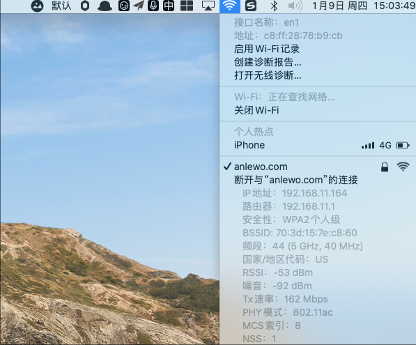

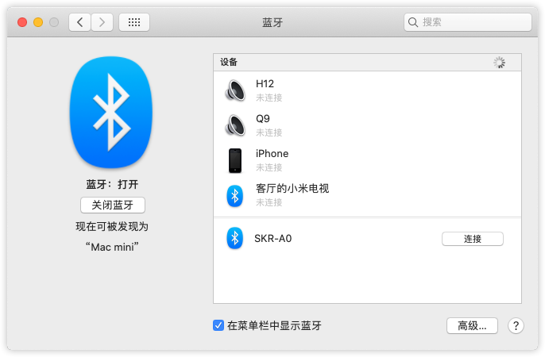

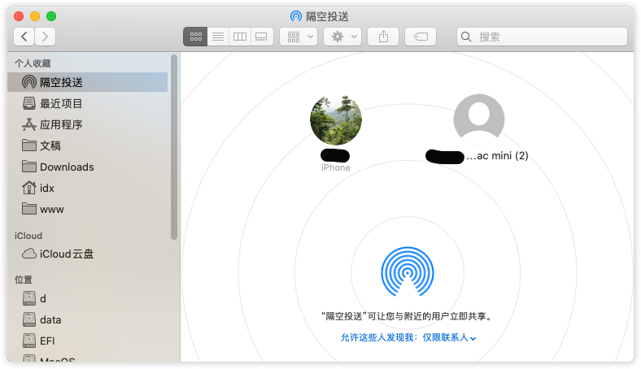


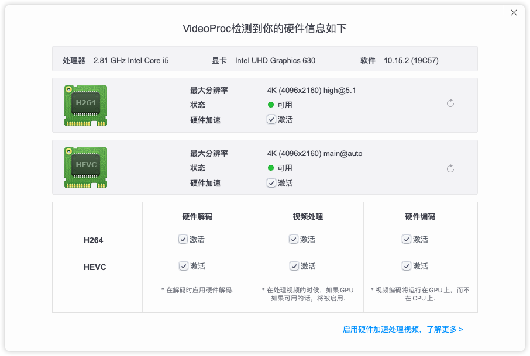


# 系统安装后

## 开启trim

```shell
sudo trimforce enable
sudo reboot
```

或者enable改clover里面的相应配置


## 系统迁移(可选)

可选

`carbon copy cloner`, 可以把sata ssd上的系统整个复制到 NVME SSD上


## 温度转速

### 安装工具

```shell
sudo gem install iStats
```

### 用法

```shell
idx ~ $ istats
--- CPU Stats ---
CPU temp:               41.0°C      ▁▂▃▅▆▇
    
--- Fan Stats ---
Total fans in system:   6
Fan 0 speed:            0 RPM       ▁▂▃▅▆▇
Fan 1 speed:            0 RPM       ▁▂▃▅▆▇
Fan 2 speed:            0 RPM       ▁▂▃▅▆▇
Fan 3 speed:            0 RPM       ▁▂▃▅▆▇
Fan 4 speed:            1451 RPM    ▁▂▃▅▆▇
Fan 5 speed:            0 RPM       ▁▂▃▅▆▇

--- Battery Stats ---
No battery on system

For more stats run `istats extra` and follow the instructions.
```

或者单独查看

```shell
idx ~ $ istats cpu
CPU temp:               40.0°C      ▁▂▃▅▆▇
idx ~ $ istats fan
Total fans in system:   6
Fan 0 speed:            0 RPM       ▁▂▃▅▆▇
Fan 1 speed:            0 RPM       ▁▂▃▅▆▇
Fan 2 speed:            0 RPM       ▁▂▃▅▆▇
Fan 3 speed:            0 RPM       ▁▂▃▅▆▇
Fan 4 speed:            1396 RPM    ▁▂▃▅▆▇
Fan 5 speed:            0 RPM       ▁▂▃▅▆▇
```


## 包管理工具

https://brew.sh/

更换源: https://mirror.tuna.tsinghua.edu.cn/help/homebrew/


## NTFS

```shell
brew cask install osxfuse
brew install ntfs-3g
sudo mv /sbin/mount_ntfs /sbin/mount_ntfs2
sudo ln -s /usr/local/sbin/mount_ntfs /sbin/mount_ntfs
```

挂载示例, 和linux下一毛一样的

```shell
sudo vim /etc/fstab
```

```shell
UUID=C753A67E-4F9A-46F9-B81C-E4364C87C6F1 none auto rw
label=disk0s3 none auto rw,noauto
```

第一行表示以读写的方式自动挂载

第二行表示不自动挂载

uuid和label可以通过diskutil工具获取, 也可以通过 关于本机>系统报告>硬件  里面的硬盘信息

> NTFS 不要开启区分大小写, 不然会导致错误无法挂载

## 如果突然无法挂载或者突然以只读方式挂载
这里有两种方案二选一, mac下不行就win下走起:

1. 直接在mac修复

   使用命令找打ntfs磁盘的label , 也就是IDENTIFIER

   ```shell
   diskutil list 
   ```
   我的ntfs盘符为`disk2s2`

   使用ntfsfix修复

   ```
   sudo ntfsfix /dev/disk2s2
   ```

   修复完成, 挂载

   ```shell
   sudo diskutil mount disk2s2
   ```

   如果此方法不生效, 再试试另一种

2. 进入win, 修复

   chkdsk <盘符> /f, 如

   ```shell
   chkdsk d: /f
   ```


### 关于丢数据:

ntfsfix(mac下)或者chkdsk(win)搞起


## 用户目录

```shell
cd ~ && mkdir -p /Volumes/d/u
mv Downloads /Volumes/d/u && ln -s /Volumes/d/u/Downloads /Users/$USER/Downloads
mv Pictures /Volumes/d/u && ln -s /Volumes/d/u/Pictures /Users/$USER/Pictures
mv Music /Volumes/d/u && ln -s /Volumes/d/u/Music /Users/$USER/Music
mv Documents /Volumes/d/u && ln -s /Volumes/d/u/Documents /Users/$USER/Documents
mv Desktop /Volumes/d/u && ln -s /Volumes/d/u/Desktop /Users/$USER/Desktop
```


## 软件

oh my zsh: https://ohmyz.sh/

```shell
brew install iterm2
brew cask install google-chrome visual-studio-code iina qq wechat motrix wpsoffice spark ezip upic notion
```

- Qspace : app store


## 取消sudo密码

```shell
echo "${USER}    ALL = (ALL) NOPASSWD:ALL" | sudo tee -a /etc/sudoers
```


# EFI

OpenCore 0.5.5

## 目录结构

```shell
.
├── APPLE
│   └── EXTENSIONS
│       └── Firmware.scap
├── BOOT
│   └── BOOTx64.efi
├── OC
│   ├── ACPI
│   │   ├── SSDT-AWAC.aml
│   │   ├── SSDT-EC-USBX.aml
│   │   ├── SSDT-EC.aml
│   │   ├── SSDT-PLUG-_SB.PR00.aml
│   │   ├── SSDT-PLUG.aml
│   │   ├── SSDT-PM.aml
│   │   ├── SSDT-PMC.aml
│   │   └── SSDT-UIAC.aml
│   ├── Drivers
│   │   ├── ApfsDriverLoader.efi
│   │   ├── FwRuntimeServices.efi
│   │   ├── HFSPlus.efi
│   │   └── NTFS.efi
│   ├── Kexts
│   │   ├── AirportBrcmFixup.kext
│   │   ├── AppleALC.kext
│   │   ├── BrcmBluetoothInjector.kext
│   │   ├── BrcmFirmwareData.kext
│   │   ├── BrcmPatchRAM3.kext
│   │   ├── IntelMausi.kext
│   │   ├── Lilu.kext
│   │   ├── SMCProcessor.kext
│   │   ├── SMCSuperIO.kext
│   │   ├── USBInjectAll.kext
│   │   ├── USBPorts.kext
│   │   ├── VirtualSMC.kext
│   │   ├── WhateverGreen.kext
│   │   └── XHCI-unsupported.kext
│   ├── OpenCore.efi
│   ├── Tools
│   │   ├── CleanNvram.efi
│   │   ├── Shell.efi
│   │   ├── VerifyMsrE2.efi
│   │   ├── libaistat.dylib
│   │   ├── rtcread
│   │   ├── smc
│   │   └── smcread
│   └── config.plist
```


## OpenCore


具体配置参考, https://khronokernel-2.gitbook.io/opencore-vanilla-desktop-guide/config.plist/coffee-lake

有图, 跟着图配置就行了, 不需要理解, 启动之后再看黑果小兵的, 理解具体什么意思, 再一个个改

### 相关图片

#### ACPI

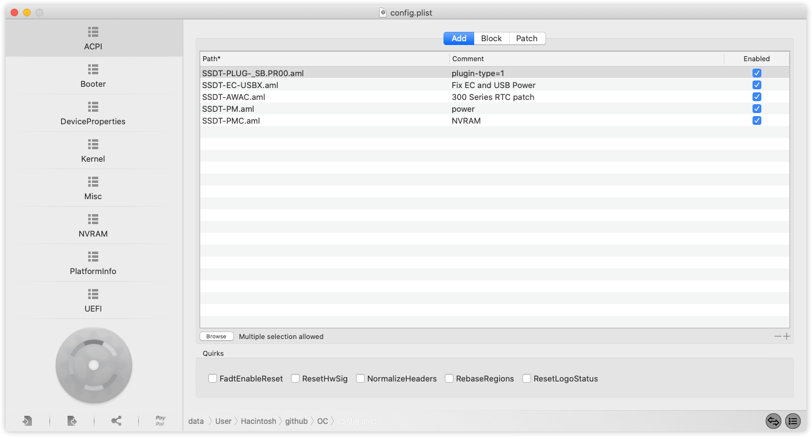

#### Booter

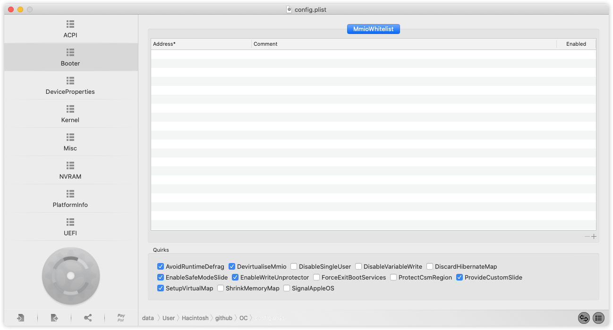

#### DeviceProperties

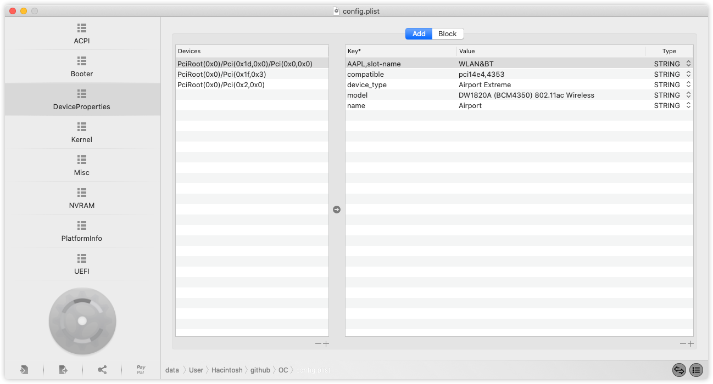

#### Kernel

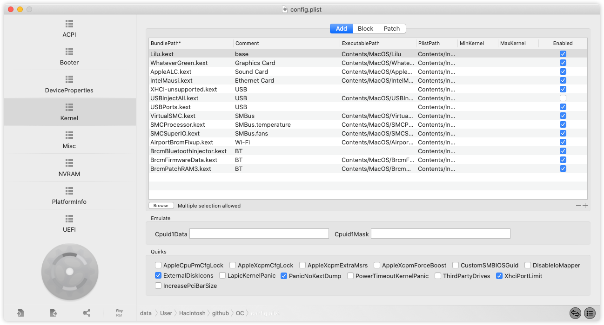

#### Misc

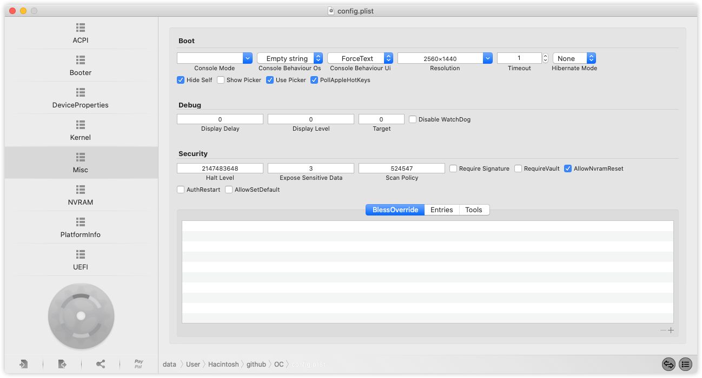

#### NVRAM

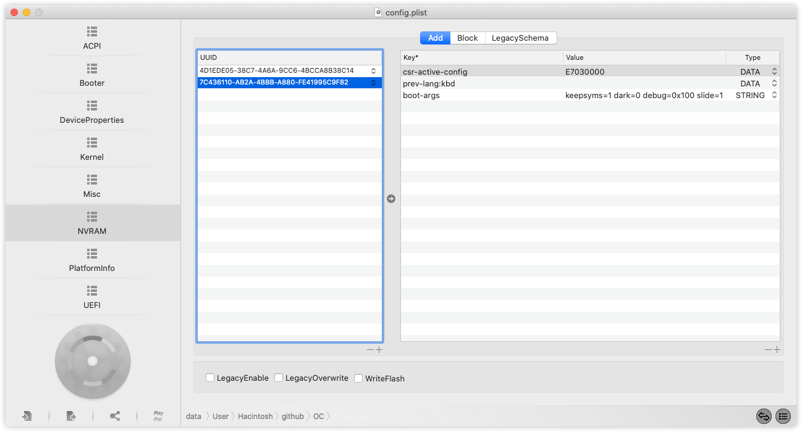

#### UEFI

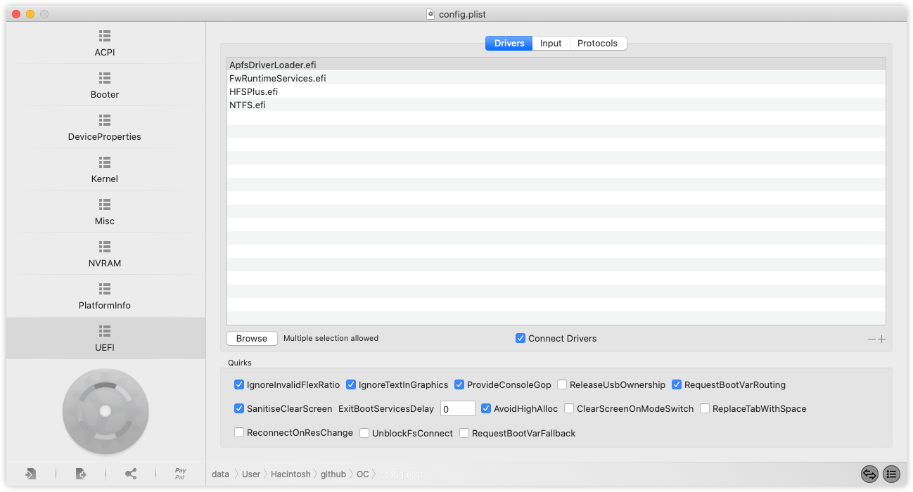


# WEPE

## 文件结构

```shell
.
├── EFI
│   ├── BOOT
│   │   └── bootx64.efi
│   └── MICROSOFT
│       └── BOOT
│           └── BCD
└── WEPE
    ├── B64
    ├── MESSAGE
    ├── PELOAD
    ├── WEIPE
    ├── WEPE.INI
    ├── WEPE.SDI
    ├── WEPE.TXT
    ├── WEPE64
    ├── WEPE64.WIM
    └── WEPEMENU.INI
```

> 开机的时候按F11, 会有多个启动项, 名字都一模一样的, 选择SSD盘的第二个启动项就能启动PE了

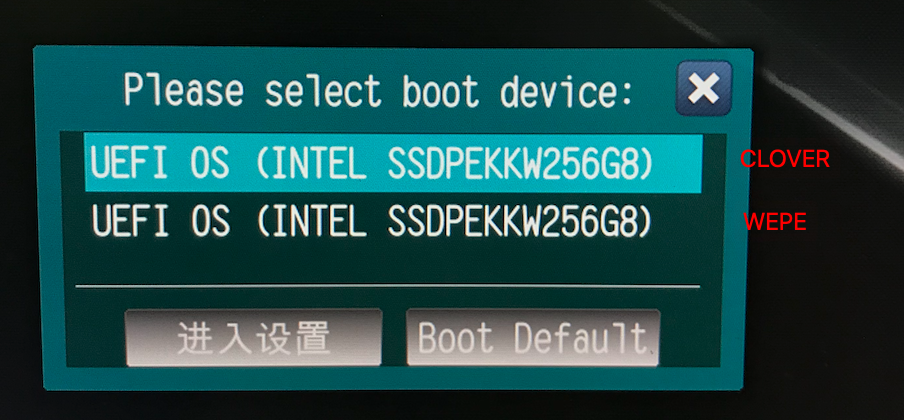


# 相关图片


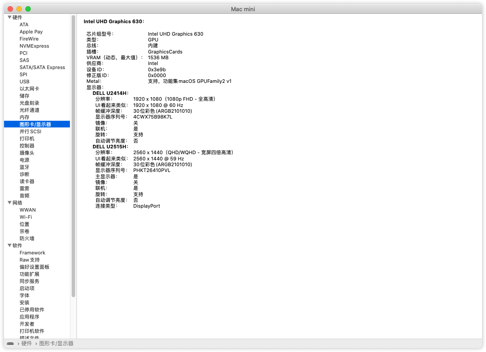

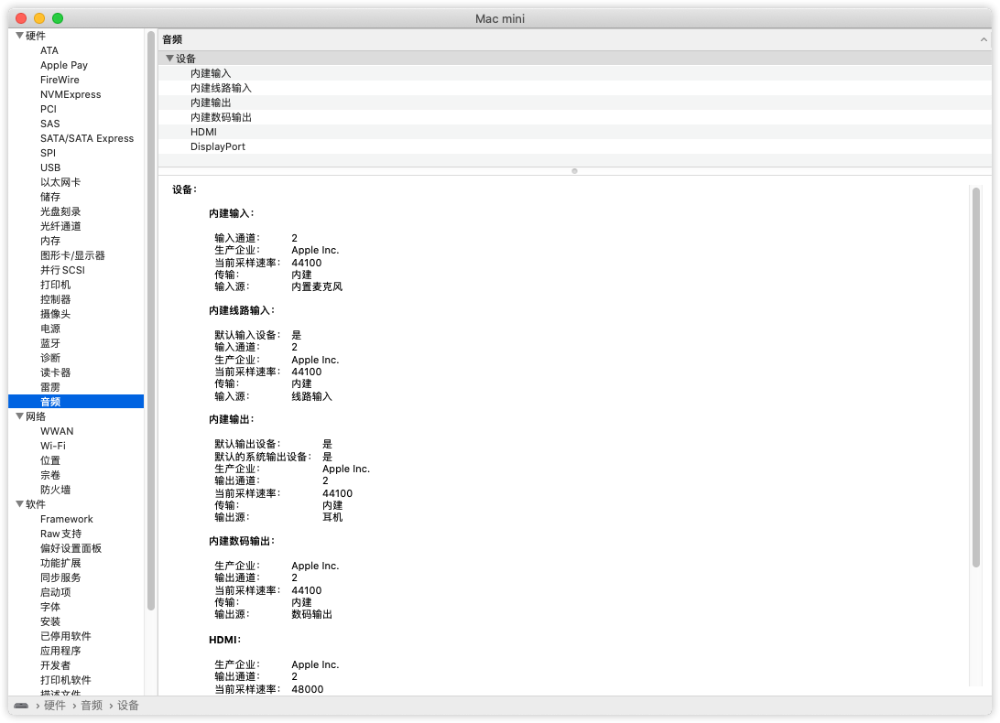

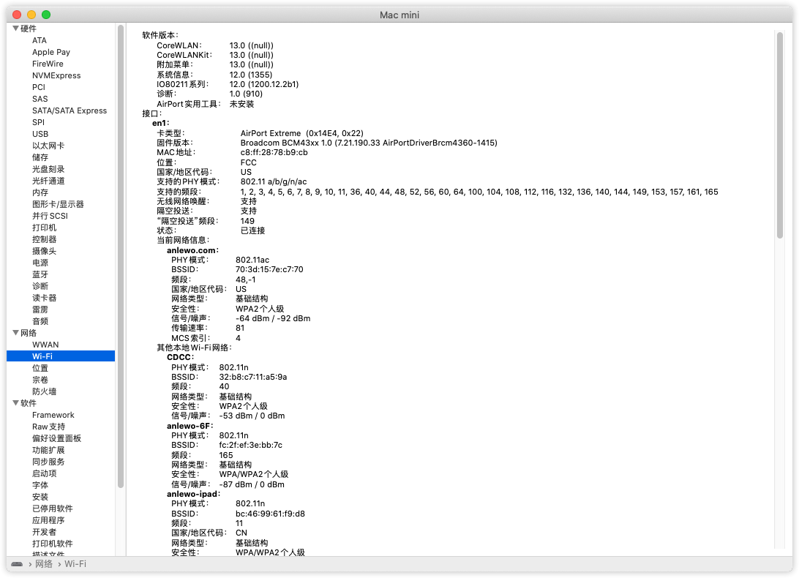

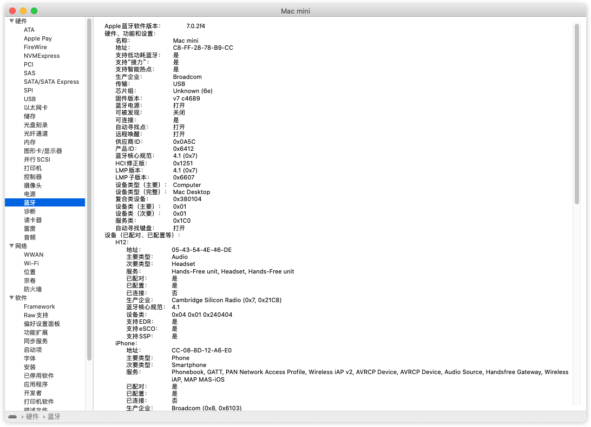


# 关于更新

我是直接更新过两次次10.15.1 → 10.15.2 →10.15.3

更新的时候要选择 `*-Data`那个分区 -> clover

我从10.15.2升级到10.15.3, 用的oc, 当时什么都没有选择, 直接就升级的


## 完成项目

### 硬件

- [x] 板载有线网卡
- [x] 板载声卡
- [x] 核显
- [x] USB
- [x] Wi-Fi
- [x] Bluetooth
- [x] CPU温度
- [x] 风扇转速
- [x] NVRAM

### 功能

- [x] AirDrop(隔空投递)
- [x] Handoff(接力)
- [ ] Sidecar(随航) 待测试
- [x] 睡眠 唤醒 关机 重启 待测试
- [x] 变频
- [x] HEVC


# 参考

[黑果小兵][黑果小兵]
[精讲OpenCore][opencore]
[显卡][gpu]
[声卡][audio]
[DW1820a][dw1820a]


[黑果小兵]: https://blog.daliansky.net
[gpu]: https://blog.daliansky.net/Tutorial-Using-Hackintool-to-open-the-correct-pose-of-the-8th-generation-core-display-HDMI-or-DVI-output.html
[audio]: https://blog.daliansky.net/Use-AppleALC-sound-card-to-drive-the-correct-posture-of-AppleHDA.html
[dw1820a]: https://blog.daliansky.net/DW1820A_BCM94350ZAE-driver-inserts-the-correct-posture.html
[opencore]: https://blog.daliansky.net/OpenCore-BootLoader.html


